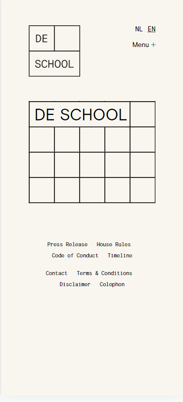
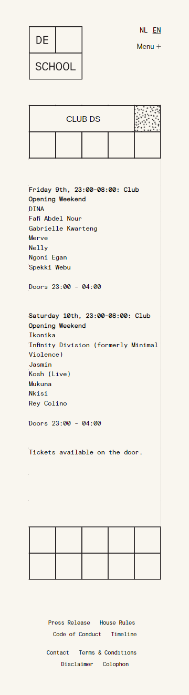

# Procesverslag
Markdown is een simpele manier om HTML te schrijven.  
Markdown cheat cheet: [Hulp bij het schrijven van Markdown](https://github.com/adam-p/markdown-here/wiki/Markdown-Cheatsheet).

Nb. De standaardstructuur en de spartaanse opmaak van de README.md zijn helemaal prima. Het gaat om de inhoud van je procesverslag. Besteedt de tijd voor pracht en praal aan je website.

Nb. Door *open* toe te voegen aan een *details* element kun je deze standaard open zetten. Fijn om dat steeds voor de relevante stuk(ken) te doen.

## Jij

  
uitwerken voor kick-off werkgroep

  ### Auteur:
  Arron Robinson

  #### Je startniveau:
  Rood

  #### Je focus:
  Responsive
 

## Je website

  
uitwerken voor kick-off werkgroep

  ### Je opdracht:
  https://www.deschoolamsterdam.nl/

  #### Screenshot(s) van de eerste pagina (small screen): 
  Home pagina
  

  #### Screenshot(s) van de tweede pagina (small screen):
  Club pagina  
  
 

## Toegankelijkheidstest 1/2 (week 1)

  
uitwerken na test in 1e werkgroep

  ### Bevindingen
  Lijst met je bevindingen die in de test naar voren kwamen:

  #### Screenreader
  Met de screenreader worden de pagina's voorgelezen met audio. Dit is handig voor bijvoorbeeld blinden en slechtzienden

  De website werd goed gelezen en ik kon geen problemen vinden.

  #### Muis en Toetsenbord 
  Met deze test werd simpelweg de toegangkelijkheid getest met muis en toetsenbord.

  De website was prima te bedienen met de muis, alleen niet helemaal goed met het toetsenbord. Wanneer je de TAB gebruikte om te navigeren liet de website niet zien waar je je op dat moment bevond. 

  #### Motoriek (shocks, elastiekjes)
  Door middel van een shock apparaat die Parkinsons nabootst en elastiekjes die een fysieke aandoening nabootst werd de toegankelijkheid van de website getest.

  Het was erg lastig om met het shock apparaat de menu items aan te klikken, omdat deze erg klein waren, gelukkig is dit makkelijk op te lossen door de knopjes groter te maken.

  #### Visueel (brillen, contrast, kleurenblind, dark/light). 
  Door middel van een aantal brillen die allemaal een andere oogaandoening nabootsten werd de website getest. Ook werd getest of de website een light en darkmode heeft.

  Weer waren de knopjes erg klein waardoor het lastig was om te zien waar je op klikte en de website had geen darkmode. 

## Breakdownschets (week 1)

  
uitwerken na afloop 2e werkgroep

  ### de hele pagina: 
  

  ### dynamisch deel (bijv menu): 
  

  ### wellicht nog een dynamisch deel (bijv filter): 
  

## Voortgang 1 (week 2)

  
uitwerken voor 1e voortgang

  ### Stand van zaken
  Ik had niet verwacht dat het maken van deze site zo moeilijk ging zijn. Op het eerste ogenblik ziet het er erg simpel uit, maar het maken van alle vierkantjes was een grote uitdaging. 

  ### Agenda voor meeting
  samen met je groepje opstellen

  | student 1      | student 2          | student 3    | student 4        |
  | ---            | ---                | ---          | ---              |
  | Border tussen de grid|             | en ik dit    | en dan ik dat    |
  | en dat ook nog | dit als er tijd is | nog een punt | dit wil ik zeker |
  | ...            | ...                | ...          | ...              |

  ### Verslag van meeting
  

## Voortgang 2 (week 3)

  
uitwerken voor 2e voortgang

  ### Stand van zaken
  Aardig wat progressie gemaakt met het maken van de vierkantjes, alleen het responsivness maken ervan was lastig.

  ### Agenda voor meeting
  samen met je groepje opstellen

  | student 1      | student 2          | student 3    | student 4        |
  | ---            | ---                | ---          | ---              |
  |                |                    | en ik dit    | en dan ik dat    |
  | en dat ook nog | dit als er tijd is | nog een punt | dit wil ik zeker |
  | ...            | ...                | ...          | ...              |

  ### Verslag van meeting
  hier na afloop snel de uitkomsten van de meeting vastleggen

  - punt 1
  - punt 2
  - nog een punt
- ...

## Toegankelijkheidstest 2/2 (week 4)

  
uitwerken na test in 8e werkgroep

  ### Bevindingen

  #### Screenreader
  De screenreader werkt prima met mijn site en ik kon geen problemen vinden.

  #### Muis en Toetsenbord 
  Het navigeren met de TAB werkte prima op mijn website

  #### Motoriek (shocks, elastiekjes)
  Ik had de knopjes groter gemaakt waardoor het navigeren met de shock apparaat wel makkelijker ging. 

  #### Visueel (brillen, contrast, kleurenblind, dark/light). 
  Door de vergrootte knoppjes was het iets makkelijk om te zien met de brillen op.
  

## Voortgang 3 (week 4)

  
uitwerken voor 3e voortgang

  ### Stand van zaken
  Responsivness werkt en de ik heb ook het veranderen van de vierkantjes onder de knie. Moet nog wel ervoor zorgen dat de logo en foto op de goeie plekken staan over de vierkantjes.

  ### Agenda voor meeting
  samen met je groepje opstellen

  | student 1      | student 2          | student 3    | student 4        |
  | ---            | ---                | ---          | ---              |
  | dit bespreken  | en dit             | en ik dit    | en dan ik dat    |
  | en dat ook nog | dit als er tijd is | nog een punt | dit wil ik zeker |
  | ...            | ...                | ...          | ...              |

  ### Verslag van meeting
  hier na afloop snel de uitkomsten van de meeting vastleggen

  - punt 1
  - punt 2
  - nog een punt
  - ...

## Eindgesprek (week 5)

  
uitwerken voor eindgesprek

  ### Je uitkomst - karakteristiek screenshots:
  
  
  

  ### Dit ging goed/Heb ik geleerd: 
  Ik heb veel geleerd tijdens dit vak. Het maken van de responsivness ging ook goed. Ik had het hiervoor namelijk nog nooit gedaan, maar ik had het al snel door. Het meeste waar ik trots zijn alle vierkantjes die ik gemaakt heb en ook dat ze mooi meegaan op verschillende schermen. Voor de rest ging het maken van de css en html ook wel goed, alhoewel ik een paar dingen niet echt mooi vind aan mijn code. 

  ### Dit was lastig/Is niet gelukt:
  Het meest lastige aan deze site waren toch de vierkantjes maken. Ook is het mij niet gelukt om de een darkmode toe te voegen aan de site.

## Bronnenlijst

